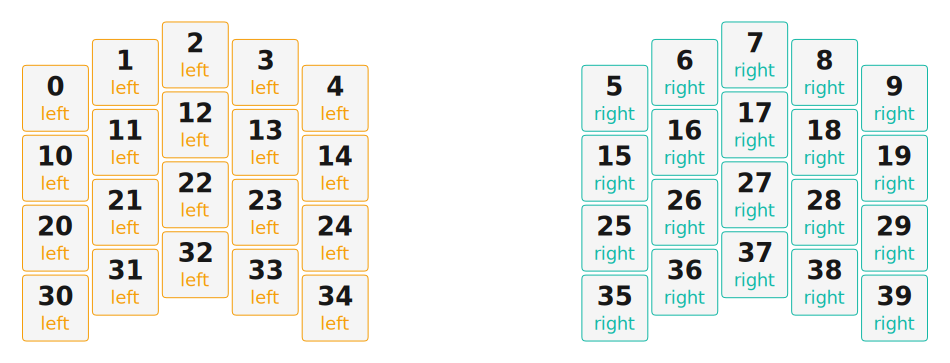

# ZMK Configuration for Split Scale KB

*Generated by Shield Wizard for ZMK*



Download compiled firmware from the Actions tab. <https://zmk.dev/docs/user-setup#installing-the-firmware>

Edit your keymap <https://zmk.dev/docs/keymaps>.
User keymap is located at [`config/split_scale_kb.keymap`](config/split_scale_kb.keymap).

-----

<details>
<summary>
Shield Wizard Debug Information
</summary>

In case of broken configuration, here is the Shield Wizard internal data used to generate this configuration:

Commit: 8a52249f61161469b6d90ed8c80c4aa52b9f3858

```json
{"name":"Split Scale KB","shield":"split_scale_kb","dongle":false,"modules":[],"layout":[{"id":"01KGPVX9N5EMV0Q1YVEYHTEDTQ","part":0,"row":0,"col":0,"w":1,"h":1,"x":0,"y":0.62,"r":0,"rx":0,"ry":0},{"id":"01KGPVX9N5RE4DFKYMN8W4S13K","part":0,"row":0,"col":1,"w":1,"h":1,"x":1,"y":0.25,"r":0,"rx":0,"ry":0},{"id":"01KGPVX9N52A461G1D32267W3K","part":0,"row":0,"col":2,"w":1,"h":1,"x":2,"y":0,"r":0,"rx":0,"ry":0},{"id":"01KGPVX9N5PW9GR4QEVE2C8D62","part":0,"row":0,"col":3,"w":1,"h":1,"x":3,"y":0.25,"r":0,"rx":0,"ry":0},{"id":"01KGPVX9N5ATR0KH9CGEJYAZDZ","part":0,"row":0,"col":4,"w":1,"h":1,"x":4,"y":0.62,"r":0,"rx":0,"ry":0},{"id":"01KGPVX9N5466PBX47CQW47QV6","part":1,"row":0,"col":5,"w":1,"h":1,"x":8,"y":0.62,"r":0,"rx":0,"ry":0},{"id":"01KGPVX9N5HCR413JFGRYC780R","part":1,"row":0,"col":6,"w":1,"h":1,"x":9,"y":0.25,"r":0,"rx":0,"ry":0},{"id":"01KGPVX9N5EV3H4YRG09RPVE8P","part":1,"row":0,"col":7,"w":1,"h":1,"x":10,"y":0,"r":0,"rx":0,"ry":0},{"id":"01KGPVX9N5ACQSZC42DNHJBE4Y","part":1,"row":0,"col":8,"w":1,"h":1,"x":11,"y":0.25,"r":0,"rx":0,"ry":0},{"id":"01KGPVX9N6P53DW2KRPVHYPRN6","part":1,"row":0,"col":9,"w":1,"h":1,"x":12,"y":0.62,"r":0,"rx":0,"ry":0},{"id":"01KGPVX9N6J48X3MVT7VFE59CF","part":0,"row":1,"col":0,"w":1,"h":1,"x":0,"y":1.62,"r":0,"rx":0,"ry":0},{"id":"01KGPVX9N69GBB0AJ733FE3F25","part":0,"row":1,"col":1,"w":1,"h":1,"x":1,"y":1.25,"r":0,"rx":0,"ry":0},{"id":"01KGPVX9N62A9XZC78NTAWKFD6","part":0,"row":1,"col":2,"w":1,"h":1,"x":2,"y":1,"r":0,"rx":0,"ry":0},{"id":"01KGPVX9N6WZNJJSQ04Y07043S","part":0,"row":1,"col":3,"w":1,"h":1,"x":3,"y":1.25,"r":0,"rx":0,"ry":0},{"id":"01KGPVX9N66HHAQ8NA9VC0SW71","part":0,"row":1,"col":4,"w":1,"h":1,"x":4,"y":1.62,"r":0,"rx":0,"ry":0},{"id":"01KGPVX9N63RBX7TK64KSGQM7S","part":1,"row":1,"col":5,"w":1,"h":1,"x":8,"y":1.62,"r":0,"rx":0,"ry":0},{"id":"01KGPVX9N65D1BJMJPD4TB04AW","part":1,"row":1,"col":6,"w":1,"h":1,"x":9,"y":1.25,"r":0,"rx":0,"ry":0},{"id":"01KGPVX9N6YHSV9GKS8T084A2G","part":1,"row":1,"col":7,"w":1,"h":1,"x":10,"y":1,"r":0,"rx":0,"ry":0},{"id":"01KGPVX9N65A6AZZTJTG0SQVN8","part":1,"row":1,"col":8,"w":1,"h":1,"x":11,"y":1.25,"r":0,"rx":0,"ry":0},{"id":"01KGPVX9N6TXF1WW2H4NRSFG5D","part":1,"row":1,"col":9,"w":1,"h":1,"x":12,"y":1.62,"r":0,"rx":0,"ry":0},{"id":"01KGPVX9N60YVRJ25M7W81X2RN","part":0,"row":2,"col":0,"w":1,"h":1,"x":0,"y":2.62,"r":0,"rx":0,"ry":0},{"id":"01KGPVX9N6MKTSDHSNVD5MKMT8","part":0,"row":2,"col":1,"w":1,"h":1,"x":1,"y":2.25,"r":0,"rx":0,"ry":0},{"id":"01KGPVX9N6KYQ5JB36DPKFNR16","part":0,"row":2,"col":2,"w":1,"h":1,"x":2,"y":2,"r":0,"rx":0,"ry":0},{"id":"01KGPVX9N6SST9A2BZPV3BF2WX","part":0,"row":2,"col":3,"w":1,"h":1,"x":3,"y":2.25,"r":0,"rx":0,"ry":0},{"id":"01KGPVX9N6JNYVE2ADWKHFGHS7","part":0,"row":2,"col":4,"w":1,"h":1,"x":4,"y":2.62,"r":0,"rx":0,"ry":0},{"id":"01KGPVX9N647QZZ4X9612F0WPS","part":1,"row":2,"col":5,"w":1,"h":1,"x":8,"y":2.62,"r":0,"rx":0,"ry":0},{"id":"01KGPVX9N6EPKFK4BCQTSAT561","part":1,"row":2,"col":6,"w":1,"h":1,"x":9,"y":2.25,"r":0,"rx":0,"ry":0},{"id":"01KGPVX9N6CBJZHFZ184K25V0D","part":1,"row":2,"col":7,"w":1,"h":1,"x":10,"y":2,"r":0,"rx":0,"ry":0},{"id":"01KGPVX9N6YVM1JJVD5H668K8G","part":1,"row":2,"col":8,"w":1,"h":1,"x":11,"y":2.25,"r":0,"rx":0,"ry":0},{"id":"01KGPVX9N6T3B1E1Q9BBW1N02Q","part":1,"row":2,"col":9,"w":1,"h":1,"x":12,"y":2.62,"r":0,"rx":0,"ry":0},{"id":"01KGPWGCHW8Q3M0HPTZ03N6MDV","part":0,"row":3,"col":0,"w":1,"h":1,"x":0,"y":3.62,"r":0,"rx":0,"ry":0},{"id":"01KGPWGE9NYNZ46AXW6B014JXC","part":0,"row":3,"col":1,"w":1,"h":1,"x":1,"y":3.25,"r":0,"rx":0,"ry":0},{"id":"01KGPWGFAFFQ9ATST0FRRFD2GT","part":0,"row":3,"col":2,"w":1,"h":1,"x":2,"y":3,"r":0,"rx":0,"ry":0},{"id":"01KGPVX9N60BG2W49E72BSRSBM","part":0,"row":3,"col":3,"w":1,"h":1,"x":3,"y":3.25,"r":0,"rx":0,"ry":0},{"id":"01KGPVX9N6SB0E3WDZGRZGWG56","part":0,"row":3,"col":4,"w":1,"h":1,"x":4,"y":3.62,"r":0,"rx":0,"ry":0},{"id":"01KGPVX9N6G8Y8HPAY8QCDZQ7D","part":1,"row":3,"col":5,"w":1,"h":1,"x":8,"y":3.62,"r":0,"rx":0,"ry":0},{"id":"01KGPVX9N6YBZAJ5A0Y2Q0HVBJ","part":1,"row":3,"col":6,"w":1,"h":1,"x":9,"y":3.25,"r":0,"rx":0,"ry":0},{"id":"01KGPVX9N652SQ2CXGX0R2R9FR","part":1,"row":3,"col":7,"w":1,"h":1,"x":10,"y":3,"r":0,"rx":0,"ry":0},{"id":"01KGPVX9N64KY33367KWFYHM2H","part":1,"row":3,"col":8,"w":1,"h":1,"x":11,"y":3.25,"r":0,"rx":0,"ry":0},{"id":"01KGPWHKSG06QMNG70YP75FKY4","part":1,"row":3,"col":9,"w":1,"h":1,"x":12,"y":3.62,"r":0,"rx":0,"ry":0}],"parts":[{"name":"left","controller":"xiao_ble","wiring":"matrix_diode","pins":{"d7":"output","d8":"output","d9":"output","d10":"output","d1":"input","d2":"input","d3":"input","d4":"input","d5":"input"},"keys":{"01KGPVX9N5EMV0Q1YVEYHTEDTQ":{"input":"d1","output":"d10"},"01KGPVX9N6J48X3MVT7VFE59CF":{"input":"d1","output":"d9"},"01KGPVX9N60YVRJ25M7W81X2RN":{"input":"d1","output":"d8"},"01KGPWGCHW8Q3M0HPTZ03N6MDV":{"input":"d1","output":"d7"},"01KGPVX9N5RE4DFKYMN8W4S13K":{"input":"d2","output":"d10"},"01KGPVX9N52A461G1D32267W3K":{"input":"d3","output":"d10"},"01KGPVX9N5PW9GR4QEVE2C8D62":{"input":"d4","output":"d10"},"01KGPVX9N5ATR0KH9CGEJYAZDZ":{"input":"d5","output":"d10"},"01KGPVX9N69GBB0AJ733FE3F25":{"input":"d2","output":"d9"},"01KGPVX9N62A9XZC78NTAWKFD6":{"input":"d3","output":"d9"},"01KGPVX9N6WZNJJSQ04Y07043S":{"input":"d4","output":"d9"},"01KGPVX9N66HHAQ8NA9VC0SW71":{"input":"d5","output":"d9"},"01KGPVX9N6MKTSDHSNVD5MKMT8":{"input":"d2","output":"d8"},"01KGPVX9N6KYQ5JB36DPKFNR16":{"input":"d3","output":"d8"},"01KGPVX9N6SST9A2BZPV3BF2WX":{"input":"d4","output":"d8"},"01KGPVX9N6JNYVE2ADWKHFGHS7":{"input":"d5","output":"d8"},"01KGPWGE9NYNZ46AXW6B014JXC":{"input":"d2","output":"d7"},"01KGPWGFAFFQ9ATST0FRRFD2GT":{"input":"d3","output":"d7"},"01KGPVX9N60BG2W49E72BSRSBM":{"input":"d4","output":"d7"},"01KGPVX9N6SB0E3WDZGRZGWG56":{"input":"d5","output":"d7"}},"encoders":[],"buses":[{"name":"spi0","devices":[],"type":"spi"},{"name":"spi1","devices":[],"type":"spi"},{"name":"spi2","devices":[],"type":"spi"},{"name":"spi3","devices":[],"type":"spi"},{"name":"i2c0","devices":[],"type":"i2c"},{"name":"i2c1","devices":[],"type":"i2c"}]},{"name":"right","controller":"xiao_ble","wiring":"matrix_diode","pins":{"d10":"output","d9":"output","d8":"output","d7":"output","d1":"input","d2":"input","d3":"input","d4":"input","d5":"input"},"keys":{"01KGPVX9N5466PBX47CQW47QV6":{"input":"d1","output":"d10"},"01KGPVX9N63RBX7TK64KSGQM7S":{"input":"d1","output":"d9"},"01KGPVX9N6G8Y8HPAY8QCDZQ7D":{"input":"d1","output":"d7"},"01KGPVX9N647QZZ4X9612F0WPS":{"input":"d1","output":"d8"},"01KGPVX9N5HCR413JFGRYC780R":{"input":"d2","output":"d10"},"01KGPVX9N65D1BJMJPD4TB04AW":{"input":"d2","output":"d9"},"01KGPVX9N6EPKFK4BCQTSAT561":{"input":"d2","output":"d8"},"01KGPVX9N6YBZAJ5A0Y2Q0HVBJ":{"input":"d2","output":"d7"},"01KGPVX9N5EV3H4YRG09RPVE8P":{"input":"d3","output":"d10"},"01KGPVX9N6YHSV9GKS8T084A2G":{"input":"d3","output":"d9"},"01KGPVX9N6CBJZHFZ184K25V0D":{"input":"d3","output":"d8"},"01KGPVX9N652SQ2CXGX0R2R9FR":{"input":"d3","output":"d7"},"01KGPVX9N5ACQSZC42DNHJBE4Y":{"input":"d4","output":"d10"},"01KGPVX9N65A6AZZTJTG0SQVN8":{"input":"d4","output":"d9"},"01KGPVX9N6YVM1JJVD5H668K8G":{"input":"d4","output":"d8"},"01KGPVX9N64KY33367KWFYHM2H":{"input":"d4","output":"d7"},"01KGPVX9N6P53DW2KRPVHYPRN6":{"input":"d5","output":"d10"},"01KGPVX9N6TXF1WW2H4NRSFG5D":{"input":"d5","output":"d9"},"01KGPVX9N6T3B1E1Q9BBW1N02Q":{"input":"d5","output":"d8"},"01KGPWHKSG06QMNG70YP75FKY4":{"input":"d5","output":"d7"}},"encoders":[],"buses":[{"name":"spi0","devices":[],"type":"spi"},{"name":"spi1","devices":[],"type":"spi"},{"name":"spi2","devices":[],"type":"spi"},{"name":"spi3","devices":[],"type":"spi"},{"name":"i2c0","devices":[],"type":"i2c"},{"name":"i2c1","devices":[],"type":"i2c"}]}]}
```

</details>
